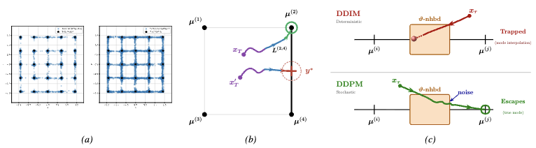

<h1 align="center">Why DDIM Hallucinates More Than DDPM: A Theoretical Analysis of Reverse Dynamics</h1> 

<p align="center">
  <a href="https://ashiqwisc.github.io/">Muhammad H. Ashiq</a><sup>*1</sup> ·
  <a href="https://openreview.net/profile?id=~Samanyu_Arora1">Samanyu Arora</a><sup>*1</sup> ·
  <a href="https://absdnd.github.io/">Abhinav N. Harish</a><sup>1</sup> ·
  <a href="https://openreview.net/profile?id=~Ishaan_Kharbanda1">Ishaan Kharbanda</a><sup>1</sup> ·
  <a href="https://openreview.net/profile?id=~Hung_Yun_Tseng1">Hung Yun Tseng</a><sup>1</sup> ·
  <a href="https://grigoris.ece.wisc.edu">Grigorios G. Chrysos</a><sup>1</sup>
</p>

<p align="center">
  <sup>1</sup>University of Wisconsin-Madison &nbsp;&nbsp;
  <sup>*</sup>Equal contribution
</p>

<p align="center">
  <a href="https://arxiv.org/abs/2605.06831">
    
  </a>
  <a href="https://www.alphaxiv.org/abs/2605.06831">
    
  </a>
  <a href="https://github.com/diffusion-hallucination.com">
    
  </a>
</p>

## Abstract

We theoretically study the hallucination phenomena in two canonical diffusion samplers: the stochastic Denoising Diffusion Probabilistic Model (DDPM) and the deterministic Denoising Diffusion Implicit Model (DDIM). We analyze the reverse ODE (DDIM) and SDE (DDPM) for a Gaussian mixture target, proving that after a critical time $\tau$, (a) DDIM can become stuck on the segment connecting the two nearest modes and (b) DDPM *stochasticity* helps it become unstuck from this region, thus avoiding hallucination. Our empirical validation verifies that DDPM has a significantly lower hallucination rate than DDIM when this region is entered. Building on our observations, we exhibit how using additional stochastic steps can help DDIM avoid hallucinations and offer new insights on how to design improved samplers. 

<p align="center">
  
</p>

## Setup
Firstly, ensure you have Anaconda installed. Then, simply clone the repository and install dependencies through create_env.sh:
```bash
chmod +x create_env.sh
bash create_env.sh ddim_vs_ddpm
conda activate ddim_vs_ddpm
```

## Usage
Before attempting to reproduce our experiments, please run:

```bash
chmod -R +x scripts
```

The core scripts are:

```bash
bash scripts/protocols/train_main_paper_model.sh # trains the main paper model on a Gaussian mixture with 25 modes 
bash scripts/protocols/run_main_paper_experiments.sh # runs the main paper experiments 
bash scripts/protocols/run_exp_d_image_experiment.sh # trains and runs the appendix image experiment 
bash scripts/protocols/train_high_dim_models.sh  # trains and runs the appendix experiments on higher dim models 
bash scripts/protocols/run_appendix_experiments.sh # runs all other appendix experiments 
```

The main Python entrypoints are `run_train.py` and `run_eval.py`. Model checkpoints and training artifacts are saved in `results/`. Evaluation outputs are saved in `eval_results/`. All protocol scripts support `DRY_RUN=true` to print commands without running them. Code for individual experiments is included in `experiments/`; a guide for each experiment file is included in `experiments/catalogue.md`.

## Citation

```bibtex
@inproceedings{ashiq2026why,
  title        = {Why DDIM Hallucinates More Than DDPM: A Theoretical Analysis of Reverse Dynamics },
  author       = {Ashiq, Muhammad H. and Arora, Samanyu and Harish, Abhinav N. and Kharbanda, Ishaan and Tseng, Hung Yun and Chrysos, Grigorios G.},
  booktitle    = {International Conference on Machine Learning (ICML)},
  year         = {2026},
}
```